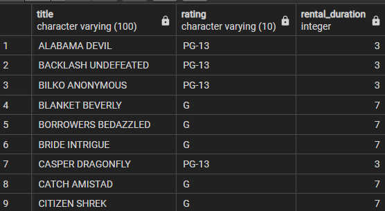
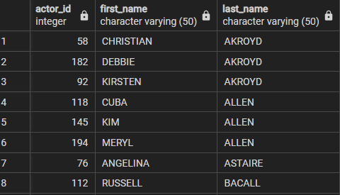
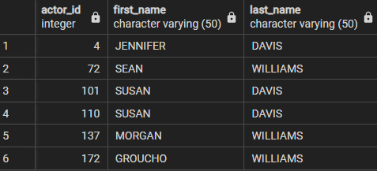

## Chapter 3: Query Primer

#### The WHERE Clause

Using 'AND' and 'OR' statements in the same query
```SQL 
SELECT title
	,rating
	,rental_duration
FROM film 
WHERE (rating = 'G' AND rental_duration >= 7)
	OR (rating = 'PG-13' AND rental_duration <4);
```


Reults 




**TEST YOUR KNOWLEDGE**

**Exercise 3-1**
Retrieve actor ID, first name, and last name for all actors. Sort by last name and then first  name.

```SQL
SELECT actor_id
	,first_name
	,last_name
FROM actor 
ORDER BY last_name, first_name;
```

Results 




**Exercise 3-2**
Retrieve the actor ID, first name and last name for all actors who's last name is Williams or Davis.

```SQL
SELECT actor_id
	,first_name
	,last_name
FROM actor 
WHERE last_name = 'WILLIAMS' OR last_name = 'DAVIS';
```

Results 




**Exercise 3-3**
Write a query against the rental table that returns the ID's of the customers who rented a film on July 5,2005. Include a single row for each distinct customer ID. 

```SQL 
SELECT customer_id
FROM rental
WHERE date(rental_date) = '2005-07-05';
```

Results 

