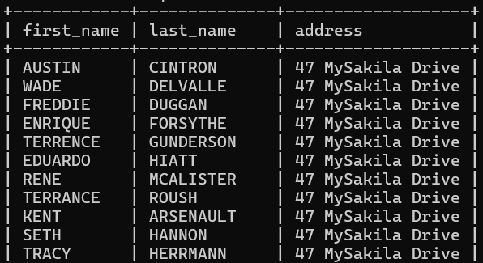
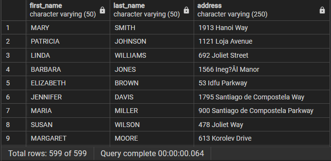
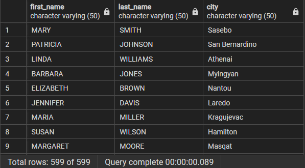
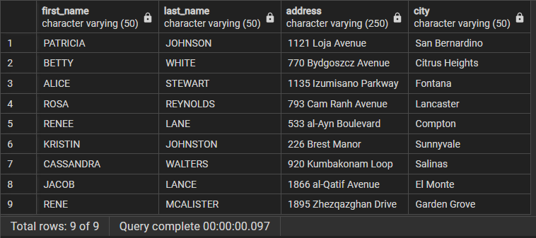

## Chapter 5: Querying Multiple Tables

**Cartesian Product**
```SQL 
mysql> SELECT c.first_name, c.last_name, a.address
    -> FROM customer c JOIN address a
    -> LIMIT 100;
```




**Inner Joins**
```SQL
SELECT c.first_name 
	  ,c.last_name 
	  ,a.address
FROM customer c JOIN address a
	ON c.address_id = a.address_id;
```





**Joining Three or More Tables**
```SQL
SELECT c.first_name
	,c.last_name
	,ct.City
FROM customer c 
INNER JOIN address a ON c.address_id = a.address_id
INNER JOIN city ct ON a.city_id = ct.city_id;
```




**Using Subqueries as Tables**
```SQL
SELECT c.first_name
	,c.last_name
	,addr.address
	,addr.city
FROM customer c 
INNER JOIN
	(SELECT a.address_id
	 	   ,a.address
	 	   ,ct.city
	 FROM address a 
	 INNER JOIN city ct ON a.city_id = ct.city_id
	 WHERE a.district = 'California'
	) addr
ON c.address_id = addr.address_id;
```



**Using the Same Table Twice**
Find all the films in which two specific actors appear, you could write a query such as this one:

```SQL
SELECT f.title 
FROM film f 
INNER JOIN film_actor fa ON f.film_id = fa.film_id
INNER JOIN actor a ON fa.actor_id = a.actor_id
WHERE ((a.first_name = 'CATE' AND a.last_name = 'MCQUEEN')
	  OR a.first_name = 'CUBA' AND a.last_name = 'BIRCH');
```


This returns all movies in which either Cate McQueen ir Cuba Birch appeared. 


To find all the films in whih both of those actors appeared, you can write a query such as this:
```SQL
SELECT f.title 
FROM film f
INNER JOIN film_actor fa1 ON f.film_id = fa1.film_id
INNER JOIN actor a1 ON fa1.actor_id = a1.actor_id
INNER JOIN film_actor fa2 ON f.film_id = fa2.film_id
INNER JOIN actor a2 ON fa2.actor_id = a2.actor_id
WHERE (a1.first_name = 'CATE' AND a1.last_name = 'MCQUEEN')
	AND (a2.first_name = 'CUBA' AND a2.last_name = 'BIRCH');
```


There are only 2 films in which both actors appeared 
- this is an example of a query that requires table aliases, since the same tables are used multiple times. 


### Test Your Knowledge

**Exercise 5-1**
Fill in the blanks for the following query to obtain the results that follow.

```SQL
SELECT c.first_name
	,c.last_name
	,a.address
	,ct.city
FROM customer c 
INNER JOIN address a ON c.address_id = a.address_id
INNER JOIN city ct ON a.city_id = ct.city_id
WHERE a.district = 'California';
```

**Exercise 5-2**
Write a query that returns the title of every film in which an actor with the first name 'JOHN' appeared. 

```SQL

```